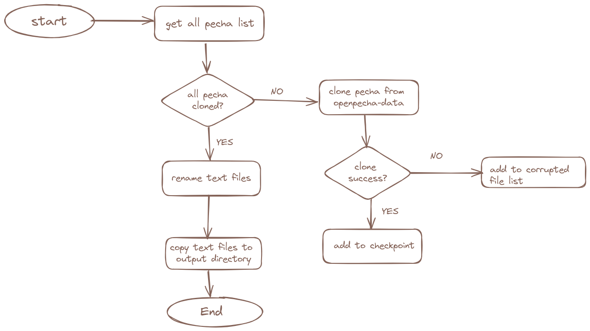

<h1 align="center">
   
  
   
</h1>

<!-- Replace with 1-sentence description about what this tool is or does.-->

<h3 align="center">openpecha_data_extract_text</h3>

## Description
1. In this work, we all cloning the pecha_id in the list of pecha repo in OpenPecha-Data orgnization Github.
2. after cloning the repo, we are rename all the text files within each pecha repo.
3. then we are copying the text files in our output folder.
Flow Diagram:

## Project owner(s)

<!-- Link to the repo owners' github profiles -->

- [@10zinten](https://github.com/10zinten)
- [@evanyerburgh](https://github.com/evanyerburgh)

## Integrations

<!-- Add any intregrations here or delete `- ` and write None-->

None
## Docs

<!-- Update the link to the docs -->

Read the docs [here](https://wiki.openpecha.org/#/dev/coding-guidelines).
